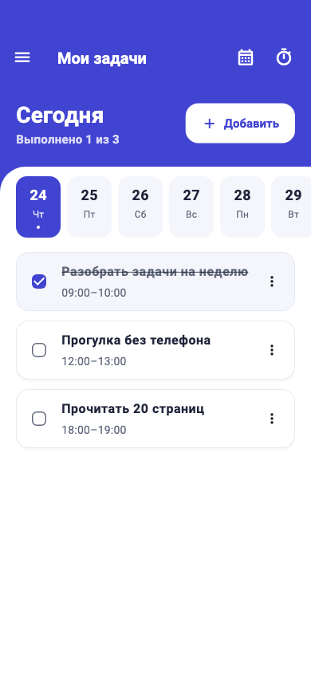
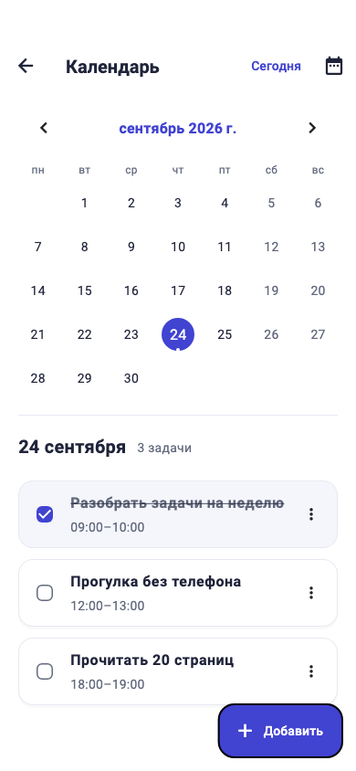
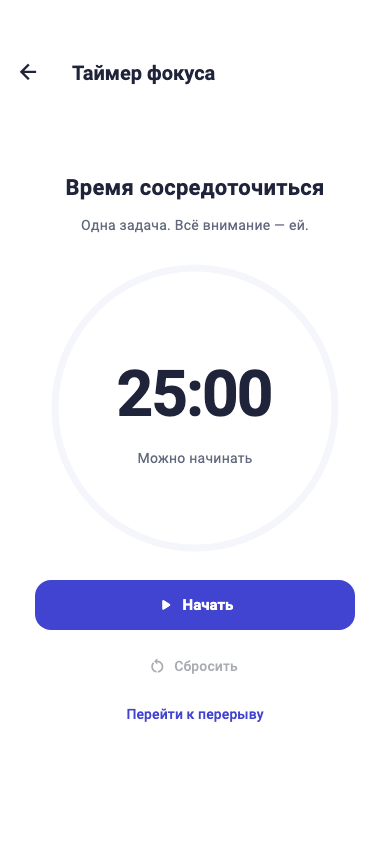
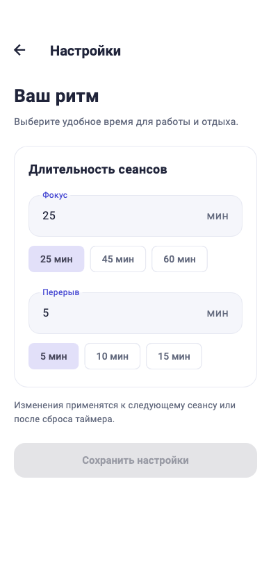

<div align="center">

# Мои задачи

**Планируйте день. Находите время для главного.**

Планировщик задач с календарём и таймером фокуса на Flutter.<br>
Русский интерфейс, локальное хранение и работа без регистрации.


[Экраны](#экраны) · [Возможности](#возможности) · [Быстрый старт](#быстрый-старт) · [Сборка](#сборка) · [Структура проекта](#структура-проекта)

</div>

## Экраны

<table>
  <tr>
    <th>Мои задачи</th>
    <th>Календарь</th>
  </tr>
  <tr>
    <td align="center"></td>
    <td align="center"></td>
  </tr>
  <tr>
    <th>Таймер фокуса</th>
    <th>Настройки</th>
  </tr>
  <tr>
    <td align="center"></td>
    <td align="center"></td>
  </tr>
</table>

*Изображения интерфейса с демонстрационными данными.*

## Возможности

### Задачи и календарь

- Создание, редактирование и перенос задач на другую дату.
- Выбор дня в недельной ленте или календаре с отметками занятых дней.
- Общая выбранная дата на главном экране и в календаре, быстрый возврат к сегодняшнему дню.
- Сортировка задач по времени, отметки выполнения и счётчик прогресса за день.
- Проверка пересечений времени, включая задачи, которые заканчиваются после полуночи.
- Форма в нижней панели: название, дата, время и длительность задачи.
- Отмена удаления в течение 8 секунд и повторная попытка при ошибке восстановления.

### Фокус и отдых

- Сеансы фокуса и перерыва с круговой шкалой прогресса.
- Запуск, пауза, продолжение, сброс и запуск следующего сеанса.
- Длительность от 1 до 120 минут; по умолчанию — 25 минут фокуса и 5 минут отдыха.
- Готовые варианты длительности и сохранение настроек между запусками.
- Изменение настроек не прерывает текущий или приостановленный сеанс.

### Интерфейс

- Полупрозрачное боковое меню с размытием и скруглёнными углами.
- Плавные переходы, анимации выбора даты и выполнения задач.
- Поддержка системного уменьшения движения и жеста возврата на iOS.
- Адаптация к небольшим экранам и увеличенному размеру текста.
- Понятные пустые состояния и повторная загрузка при ошибке запуска.

## Управление задачами

| Действие | Как выполнить |
| --- | --- |
| Добавить задачу | Нажать «Добавить» на главном экране или в календаре |
| Отметить выполнение | Нажать флажок, смахнуть карточку вправо или выбрать действие в меню |
| Вернуть задачу в работу | Повторно нажать флажок или выбрать действие в меню |
| Изменить задачу | Открыть меню карточки → «Редактировать» |
| Удалить задачу | Смахнуть карточку влево или выбрать удаление в меню |
| Отменить удаление | Нажать «Отменить» в сообщении внизу экрана |

Если окончание задачи раньше начала, интервал продолжается на следующий день. Например, **23:00–01:00** — это 2 часа, и задача отображается на обеих датах. Одинаковое время начала и окончания запрещено; соседние интервалы, например **09:00–10:00** и **10:00–11:00**, разрешены. Завершённые задачи продолжают занимать свой временной интервал.

## Быстрый старт

Понадобятся Flutter SDK с Dart **≥3.12.2 и <4.0.0**, а также устройство, эмулятор или браузер. Для Android-сборки нужен настроенный Android SDK; для iOS — macOS и Xcode.

```sh
git clone https://github.com/kumawy/Todo_app.git
cd Todo_app
flutter pub get
flutter run
```

Проверить окружение и доступные устройства:

```sh
flutter doctor
flutter devices
```

Запустить веб-версию в Chrome:

```sh
flutter run -d chrome
```

## Сборка

### Android · Debug APK

```sh
flutter build apk --debug
```

Результат: `build/app/outputs/flutter-apk/app-debug.apk`.

### Android · Release

Release-сборка требует собственного ключа подписи. Файл [`android/key.properties.example`](android/key.properties.example) — шаблон настроек, а не сам ключ.

1. Подготовьте release/upload keystore.
2. Скопируйте `android/key.properties.example` в `android/key.properties`.
3. Заполните `storeFile`, `storePassword`, `keyAlias` и `keyPassword` данными своего ключа. Путь `storeFile` может быть абсолютным или относительным к каталогу `android/`.
4. Соберите Android App Bundle:

   ```sh
   flutter build appbundle --release
   ```

Результат: `build/app/outputs/bundle/release/app-release.aab`.

`key.properties` и файлы ключей исключены из Git. Без настроенной подписи release-сборка завершится с поясняющей ошибкой; debug-сборка использует стандартный debug-ключ.

Перед публикацией замените шаблонный `applicationId` (`com.example.super_todoapp`) в [`android/app/build.gradle.kts`](android/app/build.gradle.kts) на идентификатор своего приложения.

### Web

```sh
flutter build web
```

Готовая сборка находится в `build/web/`.

## Стек

| Инструмент | Назначение |
| --- | --- |
| Flutter / Dart | Интерфейс и логика приложения |
| Provider | Состояние задач, настроек и таймера |
| Hive / Hive Flutter | Локальное хранение данных |
| GoRouter | Навигация между экранами |
| Table Calendar | Календарь задач |
| Flutter Localizations | Русская локализация системных компонентов |

## Структура проекта

```text
lib/
├── main.dart                  # Инициализация Hive и запуск приложения
├── app_theme.dart             # Общая тема, цвета и параметры анимаций
├── router.dart                # Маршруты и переходы между экранами
├── date_limits.dart           # Единые границы допустимых дат
├── provider.dart              # Управление задачами и проверка интервалов
├── focus_provider.dart        # Таймер и настройки сеансов
├── models/
│   ├── tasks.dart             # Модель задачи
│   └── tasks.g.dart           # Сгенерированный адаптер Hive
├── screens/                   # Главная, календарь, фокус и настройки
└── widgets/                   # Карточки, формы, меню и выбор времени
test/                          # Тесты логики и интерфейса
docs/screenshots/              # Изображения для README
```

## Проверки

```sh
flutter analyze
flutter test
```

Тесты покрывают операции с задачами, пересечения интервалов и переход через полночь, ошибки хранения и восстановление после удаления, таймер и настройки. Проверки интерфейса включают небольшие экраны, крупный текст, навигацию, уменьшение движения и повторную загрузку данных.

Тесты логики используют временные файлы Hive и имитацию ошибок записи; тесты интерфейса — хранилище в памяти.

При изменении модели Hive адаптер можно обновить командой:

```sh
dart run build_runner build --delete-conflicting-outputs
```

Существующие идентификаторы типа и полей Hive нужно сохранять для совместимости с уже записанными задачами.

## Данные и особенности

- **Локальное хранение.** Задачи находятся в боксе Hive `tasks`, настройки — в `settings`. Аккаунтов и облачной синхронизации нет.
- **Сохранение.** Изменения отображаются после успешной записи. При ошибке запуска данные автоматически не удаляются — можно повторить загрузку.
- **Работа таймера.** Он учитывает прошедшее время при переходах между экранами и после возвращения из фона. После завершения процесса приложения текущий сеанс сбрасывается. Системных уведомлений и звукового оповещения нет.
- **Боковое меню.** Имя и email заданы в коде как демонстрационные данные; отдельного экрана профиля нет.
- **Платформы.** В репозитории есть каталоги Android, iOS, Web, macOS, Windows и Linux. Проверена сборка Android Debug и Web; остальные платформы требуют отдельной проверки.
